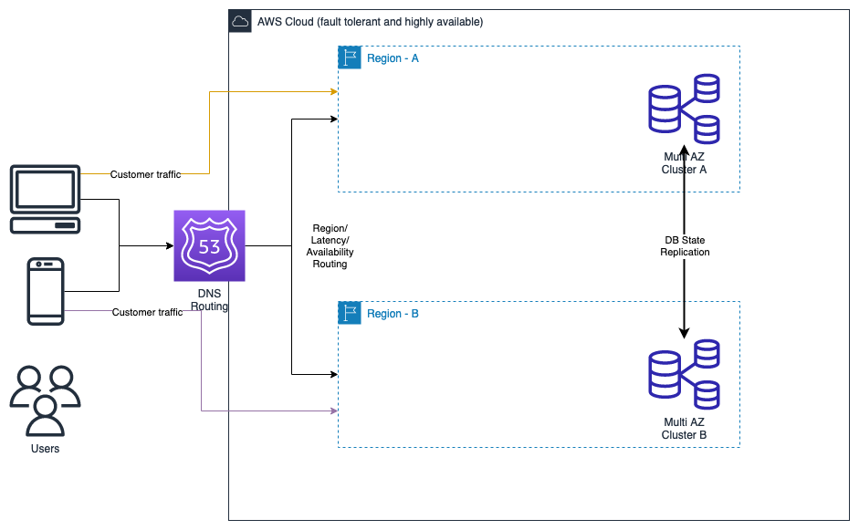
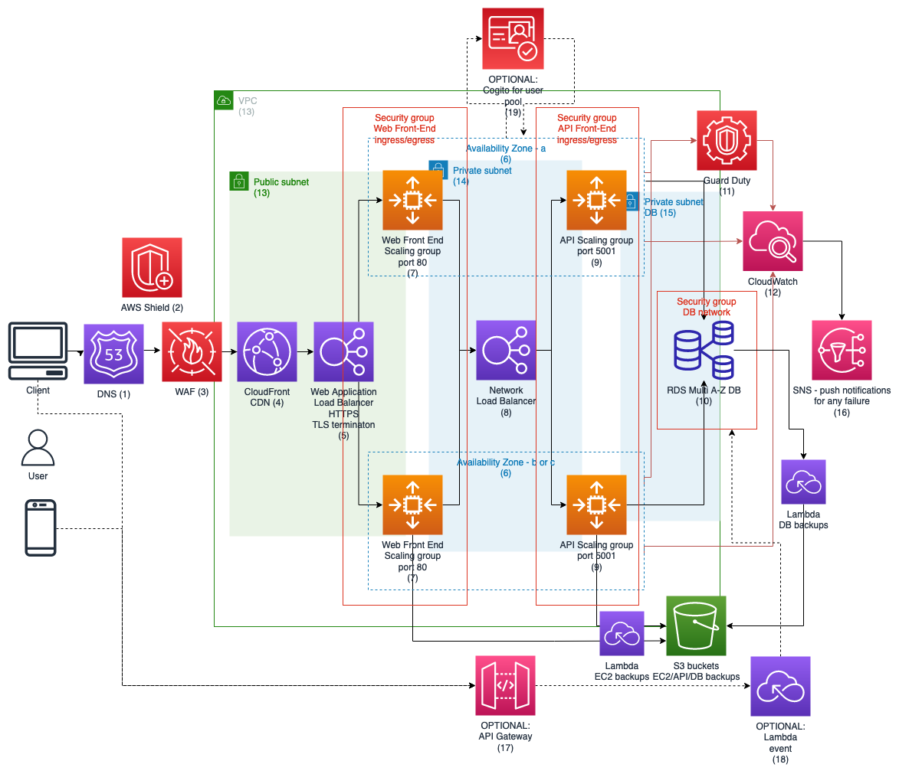

# E-commerce AWS platform
<b>DISCLAIMER: This is the solution I came up with in the limited time I've had.</b>

## Requirements
- minimal downtime 
- maximum scalability
- highly available
- fault-tolerant

## Task
Your task is to provide an architectural diagram of your proposed solution, including the following components with detailed specifications and justifications:

- DNS management
- Load balancing
- Web/Application tier
- Database tier
- Auto-scaling
- Security & Compliance 
- Disaster recovery

## Assumptions
- The e-commerce solution entails 3-tier system architecture with web tier, application(API) tier, DB tier.
- The tiers are isolated and communicate via private network subnets (14,15).
- The DB is holding only the information about products, payment transactions and users registered to the e-commerce site. THere are no information provided for data growth over time. I can assume that for 
- There is not much information about payment provider. But payment transaction may be realized via API call from the front-end or API tier to the provider. It is recommended to validate the data in the API tier then send request to the payment provider from there via egress-only internet gateway.
- There are no information about computational silhouette of the solution(min. CPU compute time required, RAM or latency requirement)
I assume here we have mili-second communication latency with the API-to-DB and Front-end-to-API. The computation is miniscule and major limiting factor will be DB input/output transactions per second (IOPS)
- The clients is only interacting with the web front-end in the public subnet(13) via HTTP/HTTPS protocols - no direct API calls. (Optional, there is a chance to realize some event driven calls the external API gateway(17) and Lambda compute(18) function to support those calls)
- We are using relational DB. Not NoSQL.
- The user data is stored in the database and e-commerce authentication and authorization is realized via information in the DB (There is an option to use the AWS Cogito service for user pool, token generation, etc. but I've assumed this user management is also part ot the application)

## Diagrams

### High view of the solution
The first diagram shows the global infrastructure which would entail the fully fault tolerant and resilient architecture which would entail at least 2 regions.

This effectively doubles the cost of the infrastructure plus adds extra complications related to the region data replication (if required).
By default, any customer personally identifiable information (PII) generated in one region should just reside in this region due to the limitations like GDPR or other local regulations. 
Data would be locally backup and stored at required location in S3 buckets.
Other data can be replicated to the desired location for analytics and other purposes.

### Detailed view of the region
The second diagram shows the single region view with highly available and fault tolerant solution spanning across at least two availability zones in the region.

## Description

### DNS management
We will use Route 53 DNS (1) service as it provides features like geo and/or latency path routing.
This is the first point we can make decision which region we will present to the customer and redirect accordingly.
Route 53 also provides health checks to actively provide only the accessible end points to the customer. This allows to take out end points from DNS zone and we can maintain/replace parts of the infrastructure independently of the system being used or not.

### Load balancing
I'd recommend using Application load balancer(5) for front-end with two listeners on port 80 and 443 TCP (HTTP/HTTPS respectively) This type of LB provides support for multiple computational models (EC2 - instances, ECS - containers, Lambda - function as a service) plus enables full logging to S3 buckets for auditing purposes 

For API layer I'd recommend using Network load balancer(8) as this layer can handle millions of requests from our front-end. It also provides resiliency and easier maintenance when we need to recover from failure or maintain/deploy API part of the solution.

### Web/Application(API) tier
We have three options here as we can use EC2/ECS/Lambda services (virtual machine/container/function computation). 
In my case I've chosen EC2 instances for simplicity. Alternatively, if this layer is required as containers, I'd recommend using ECS compute resources as it provides similar auto-scaling capability to EC2
For speed or access and deployment I'd recommend using AWS's ECR (container registry) to manage custom containers.

### Database tier
The fully fault tolerant requirement suggests only one solution for RDS (10) which is fully managed Amazon Aurora DB serverless service. With SLA uptime 99.99% and region disaster recovery in less than 1min. This is expensive solution but provides all requirements for the quick recovery and restoration in the event for catastrophic failure of the region.

Alternative, would be to use cheaper RDS DB options and with extra maintenance cost of self-made replication solution between regions. 

Both solution provide high-availability with Multi-AZ options per region and should be corroborated with business availability of the whole solution.

### Auto-scaling
We have scaling groups (7) of EC2 instances and based on the CPU utilization we would scale up to the required level. 
My recommendation would be to use minimum two on-demand instances per Web tier scaling group and complement them with Spot instances during the burst situations
We would use cloudWatch(12) information to tune up or down the solution 
My recommendation for the API tier scaling group(9) is exactly the same as for front-end. After analysis of the trend usage data for those nodes we can tune up or down the required compute resource.

### Security & Compliance
AWS provides layered approach to security with multiple options available.

I'd recommend use of all security best practices:
- network compartmentalization - we use public and private subnets in the VPC for controlling the network traffic
- network security groups (firewall rules) for each tier
- minimal privilege rule - for any service accounts with appropriate IAM roles allowing only for minimal set of permissions. In example Web front-end auto-scaling only able to scale the instances/containers and read information from the system to inform scale up or down web front-end. The same with other aspects of the system like backups roles only allowed to the resources they need to fulfill the task.
- For external risk mitigation, I'd recommend using AWS Shield (2) for DDoS prevention (ISO/OSI layer 2) and Web Application Firewall - WAF(3) for traffic filtering (ISO OSI layer 3 and 4). This prevents against SQL injection and XSS attacks as well as adds ability to create custom filters for specific traffic patterns.
- I would also suggest to use CloudFront (4) which acts as the CDN and provides caching capabilities for front-end plus provides guaranteed availability for the endpoint by AWS.
- Any critical or PII Data should be encrypted during the communication and at rest (backups, DB volumes and instances volumes) Use of encrypted volumes for the DB is recommended as well as use of TLS encryption for external and internal communication.
In theory the use of private subnets isolates traffic but for sensitive data I'd recommend the encryption between all microservices and use of internal certificates with session tokens.

For visibility I'd recommend to use CloudWatch(12) for logging all available aspects of the system to S3 buckets and based on the signals form the environment use SNS push notifications service for any failure (could be emails, text messages, other automated actions)

Additionally, use of GuardDuty (11) is recommended to analyze system security events. This service provides threat detection and continuously monitors accounts and workloads for malicious activity. The output can be fed to the cloudWatch and SNS to push notifications to maintenance/security team.

### Disaster recovery
The critical parts of the system are:
- Cloud configuration of the system, ex. VPC, IAMs, subnets, custom images, rules, etc
- Front end image/container image/Lambda artifact
- Application image/container image/Lambda artifact
- DB data

There are two disaster scenarios:
- complete loss of region
- partial loss of the service

By using two regions we can easily mitigate full region loss. However, this will effectively double the cost of the infrastructure.

In case of singular region solution we can recover the whole infrastructure from infrastructure As Code (IaC) automation in a git repository. Choosing the target as a different region.
This should be automated and tested daily/nightly to confirm the IaC is still adequate when actual disaster happens.

There is also AWS alternative called AWS Elastic Disaster Recovery service to recover applications/infrastructure in other AWS region. 

<b>DISCLAIMER: I've personally never used AWS EDR service and would need more time to find out more practical implications of a recovery with this service in other region.</b>

My personal preference was to always recover from IaC to dev account and confirm the git repository can create/test/delete required infrastructure.

## Maintenance
This three tier solution enables easier maintenance and replacement for underlying loosely coupled microservices.
I recommend to fully code the solution with use of Terraform/CloudFormation.
Any backups should also be replicated across the regions or multi-region S3 buckets should be used to store any critical configuration and application data.

## Cost estimate
Please see the estimates in the [pricing folder](./pricing)
or quote on [the AWS pricing calculator](https://calculator.aws/#/estimate?id=03015dbcbbfe0f970c46b6d0dcc28b49e849f354)

<b>This is estimate for single region. Dual region solution will double this estimate plus we will need to add cost for data replication.</b>

Assumption is that the auto-scaling groups are constructed of:
- 2 pre-paid instances
- 4 SPOT instances
per availability zone

I've chosen the t4g.small, t4g.small - 2vCPUs, 2GB RAM, Linux based instance as default for groups (front End , API more details in the price estimates)

DISCLAIMER: I haven't added Cloud Shield (big price jump as it is  3000USD per month and would balloon the price significantly)

## Performance consideration
There are option to create better decoupling of the components with introduction of queues or caches to migrate any performance concerns.  This may increase complexity and cost.
